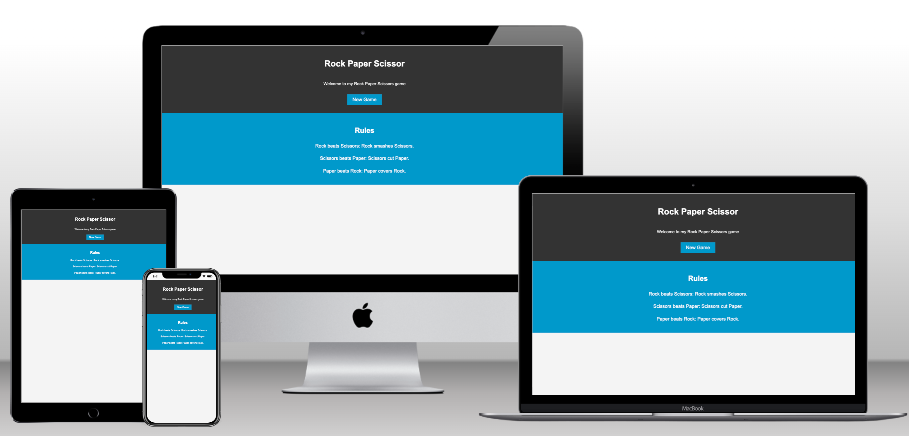
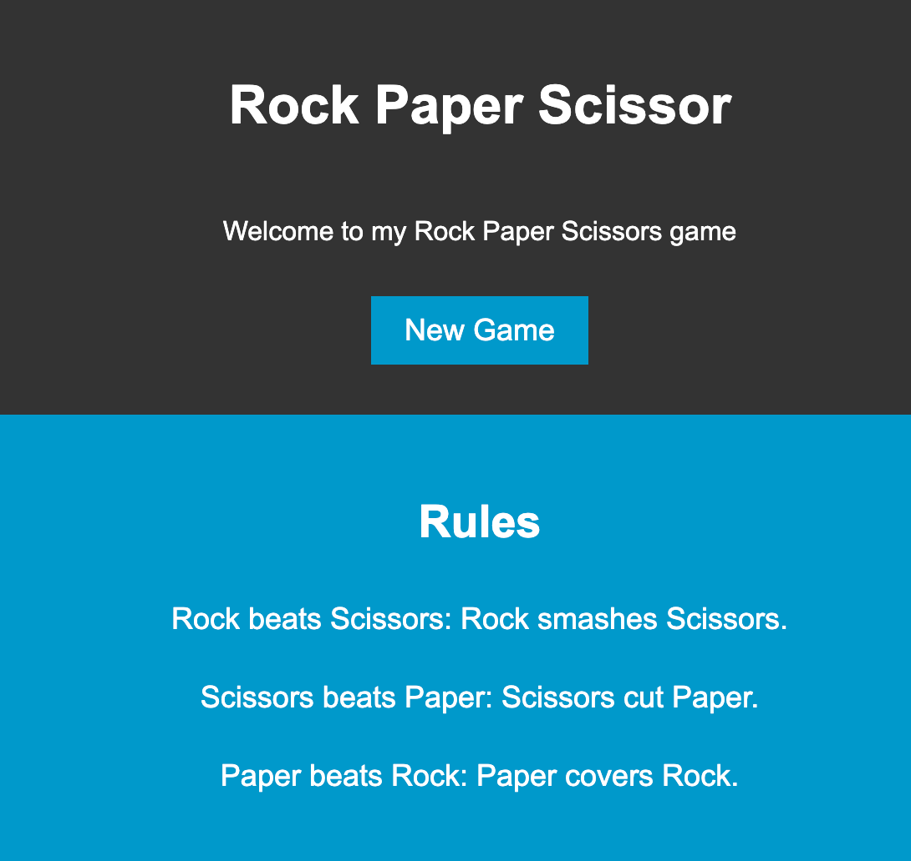
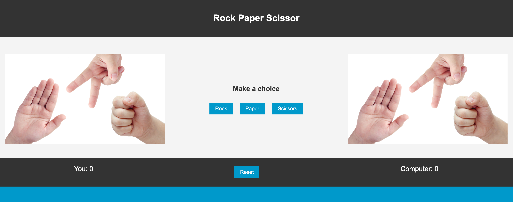
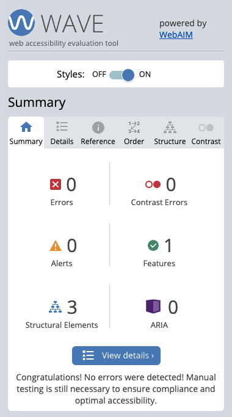
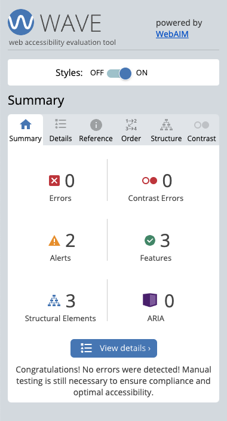

# Rock Paper Scissors
Rock Paper Scissors is a web based game built with HTML, CSS and JavaScript language. It's basesd on the classic rock paper scissors game and targeting users who wants to have fun playing with a computer.

## Features 

### Landing Page:

The website consists of two webpages

* Welcome Page: 
    * Welcome page is the first page the user gets when he loads the website
    * It contains the games rules and a button that will load the user to the game

    

* Game Page:
    * Game page where users start to play the game.
    * It contains 3 buttons of users to choose rock paper or scissors.
    * Once the user selects it will change the left picture according to the user choice.
    * Computer will decide to choose randomly between the 3 options.
    * Once the computer decides the right image will change according to the computer choice.
    * There is a place for score and paragraph section tells which one wins.
    * There is a reset button if the user wants to reset the score.

 ### Existing Features 
 * Responsive design
 * Score calculation
 * Restarting the game
 

## Technologies 
* HTML
    * The structure of the Website was developed using HTML as the main language.
* CSS
    * The Website was styled using custom CSS in an external file.
* JavaScript
    * The logic of the game was done using JavaScript    
* Visual Studio Code
    * The website was developed using Visual Studio Code IDE
* GitHub
    * Source code is hosted on GitHub and delpoyed using Git Pages.
* Git
    * Used to commit and push code during the development opf the Website
* Tinyjpg
    * https://tinyjpg.com/ was used to reduce the size of the images used throughout the website
* favicon.io
    * favicon files were created 
* pexels.com
    * https://www.pexels.com/ was used to get the images for my website   

 ## Testing
  ### Responsiveness 
The pages underwent testing to ensure they were responsive across various screen sizes starting from 320px and above. The testing was performed on Chrome, Edge, Firefox, and Opera browsers.

Steps to test:
1. Open browser and navigate to [Rock Paper Scissors](https://moabdelbasset.github.io/rps/)
2. Open the developer tools (right click and inspect)
3. Decrease the screen width to 320px
4. Set the zoom to 50%
5. Click and drag the responsive window to maximum width

Expected:
Website is responsive on all screen sizes and no images are pixelated or stretched.
No horizontal scroll is present.
No elements overlap.

Actual:
Website was responsive on all screen sizes and no image was pixelated or stretched.
Horizontal scroll was present because of the schedule section.
Tested on Iphone 12 and Samsung Galaxy S8.

## Accessibility

[Wave Accessibility](https://wave.webaim.org/) tool was used throughout development and for final testing of the deployed website to check for any aid accessibility testing.

Testing was focused to ensure the following criteria were met:

- All forms have associated labels or aria-labels so that this is read out on a screen reader to users who tab to form inputs
- Color contrasts meet a minimum ratio as specified in [WCAG 2.1 Contrast Guidelines](https://www.w3.org/WAI/WCAG21/Understanding/contrast-minimum.html)
- Heading levels are not missed or skipped to ensure the importance of content is relayed correctly to the end user
- All content is contained within landmarks to ensure ease of use for assistive technology, allowing the user to navigate by page regions
- All not textual content had alternative text or titles so descriptions are read out to screen readers
- HTML page lang attribute has been set
- Aria properties have been implemented correctly
- WCAG 2.1 Coding best practices being followed

